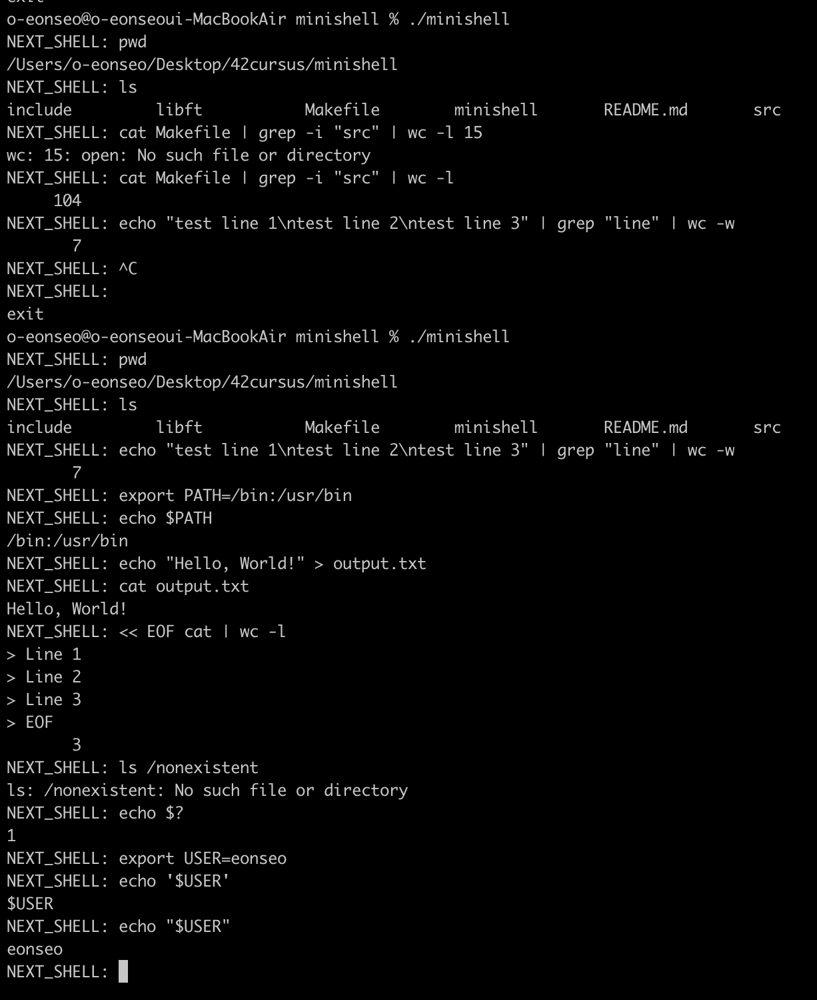

# minishell

> Bash의 핵심 기능을 재구현한 Unix 셸


## 📖 프로젝트 소개

Bash 셸의 주요 기능을 구현한 프로젝트입니다. 명령어 실행, 파이프, 리다이렉션, 환경 변수, 빌트인 명령어 등 셸의 핵심 기능을 모두 지원합니다.



## ✨ 주요 기능

### 명령어 실행
- 실행 파일 검색 및 실행 (PATH 환경변수 활용)
- 상대/절대 경로 지원

### 파이프
- 다중 파이프 체인 지원: `cmd1 | cmd2 | cmd3`

### 리다이렉션
- 입력: `< file`
- 출력: `> file` (덮어쓰기)
- 추가: `>> file`
- Here_doc: `<< EOF`

### 빌트인 명령어
- `echo` (with -n option)
- `cd` (상대/절대 경로)
- `pwd`
- `export` / `unset`
- `env`
- `exit`

### 추가 기능
- 환경 변수 확장: `$VAR`, `$?`
- 쿼트 처리: 작은따옴표, 큰따옴표
- 시그널 처리: Ctrl-C, Ctrl-D, Ctrl-\\

## 🚀 실행 방법

```bash
make
./minishell
```

## 💻 사용 예시

```bash
minishell$ ls -la | grep minishell | wc -l
minishell$ export NAME=value
minishell$ echo $NAME
minishell$ cat < input.txt | grep hello > output.txt
minishell$ << EOF cat | wc -l
> line 1
> line 2
> EOF
```

## 🛠️ 기술 스택

- **언어**: C
- **라이브러리**: Readline
- **시스템 콜**: fork, execve, pipe, dup2, wait
- **핵심 개념**: 프로세스 관리, 파싱, 시그널 처리

## 📚 학습 내용

- Unix 셸의 동작 원리
- 프로세스 생성 및 관리
- 복잡한 문자열 파싱 (토큰화, 쿼팅)
- 파이프와 리다이렉션 구현
- 시그널 처리

## 💡 구현 특징

- Bash와 동일한 동작 (차이점 최소화)
- 메모리 누수 없음 (Readline 제외)
- 모든 엣지 케이스 처리
- 복잡한 파이프라인 지원

---

**minishell - Custom Shell Implementation**
